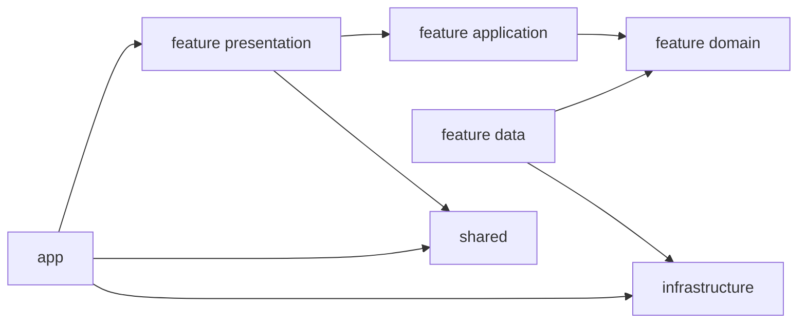

# Feature-First Clean Boundaries Migration Plan

## Hedef

Mevcut layer-first yapıyı, bu repo için sürdürülebilir bir `feature-first + clean boundaries` mimarisine taşımak.

Bu plan şu teknik kararları esas alır:

- `flutter_bloc` korunur.
- `go_router` korunur.
- Manuel model serileştirme korunur.
- İlk aşamada multi-package yapıya geçilmez.
- Feature klasörleri başlangıçta düz tutulur; yalnızca alan büyürse `bounded context` gruplamasına geçilir.

## Mevcut Durumdan Çıkan Kritik Sorunlar

- `[/home/cevheri/projects/dart/flutter_bloc_advance/lib/main/app.dart](/home/cevheri/projects/dart/flutter_bloc_advance/lib/main/app.dart)` içinde UI katmanı doğrudan `Repository()` ve `Bloc()` üretiyor. Bu yüzden composition root ile feature sınırları karışmış durumda.
- `[/home/cevheri/projects/dart/flutter_bloc_advance/lib/routes/go_router_routes/app_go_router_config.dart](/home/cevheri/projects/dart/flutter_bloc_advance/lib/routes/go_router_routes/app_go_router_config.dart)` yalnızca route toplamakla kalmıyor; redirect içinde `AccountBloc` event de fırlatıyor. Router saf karar verici değil.
- `[/home/cevheri/projects/dart/flutter_bloc_advance/lib/routes/go_router_routes/routes/user_routes.dart](/home/cevheri/projects/dart/flutter_bloc_advance/lib/routes/go_router_routes/routes/user_routes.dart)` static mutable repository/bloc state tutuyor. Bu test, hot reload ve feature ownership açısından zayıf bir desen.
- `[/home/cevheri/projects/dart/flutter_bloc_advance/lib/presentation/shell](/home/cevheri/projects/dart/flutter_bloc_advance/lib/presentation/shell)` uygulama kabuğu olmasına rağmen `presentation` altında duruyor; ayrıca eski `drawer` yapısıyla iç içe.
- `[/home/cevheri/projects/dart/flutter_bloc_advance/lib/presentation/design_system](/home/cevheri/projects/dart/flutter_bloc_advance/lib/presentation/design_system)` iyi ayrılmış olsa da konumu yanlış; bu modül feature değil, shared UI altyapısı.
- Testler hâlâ layer-first yapıyı yansıtıyor: `[/home/cevheri/projects/dart/flutter_bloc_advance/test](/home/cevheri/projects/dart/flutter_bloc_advance/test)`.

## Hedef Mimari

```text
lib/
  app/
    bootstrap/
    di/
    router/
    shell/
    theme/
    localization/
    app.dart

  core/
    errors/
    result/
    logging/
    types/

  infrastructure/
    http/
    storage/
    config/

  shared/
    design_system/
    widgets/
    extensions/

  features/
    auth/
      data/
      domain/
      application/
      presentation/
      navigation/
    account/
      data/
      domain/
      application/
      presentation/
      navigation/
    users/
      data/
      domain/
      application/
      presentation/
      navigation/
    dashboard/
      data/
      domain/
      application/
      presentation/
      navigation/
    settings/
      application/
      presentation/
      navigation/
```

## Mimari Kararlar

- `app/`: composition root, router, shell, theme bootstrap, localization bootstrap.
- `core/`: iş kurallarından bağımsız primitive/cross-cutting türler. Tema, widget, route burada olmayacak.
- `infrastructure/`: HTTP, local storage, environment, config gibi dış dünya adaptörleri.
- `shared/`: business-free reusable UI ve design system.
- `features/`: gerçek business capability modülleri.
- `application/`: BLoC/Cubit + use-case orchestration katmanı. Bu repo için use-case’leri `domain` içinde bırakmak yerine `application` altında toplamak daha okunabilir olacaktır.
- `navigation/`: feature’ın public route entry noktası. Route tanımı feature yanında olacak, global composition `app/router` içinde yapılacak.

## Boundary Kuralları




Zorunlu kurallar:

- Bir feature başka bir feature'ın `presentation` veya `data` katmanını import etmez.
- `presentation` katmanı concrete repository üretmez.
- Router redirect fonksiyonları veri yüklemez; yalnızca navigation kararı verir.
- `shared` içinde business logic bulunmaz.
- `core` içine UI concern konmaz.
- `generated/` ve `l10n/` ilk aşamada yerinde kalır; feature bazlı localization bu migration’ın ilk hedefi değildir.

## Referans Projeden Alınacaklar

Referans yapı: `[/home/cevheri/projects/dart/xrise-ui/lib/features](/home/cevheri/projects/dart/xrise-ui/lib/features)`

Özellikle alınması gerekenler:

- feature-local `data/domain/presentation/di` düşüncesi
- feature barrel/export yaklaşımı
- feature-local DI registration modeli
- gerektiğinde feature-local `shared` veya `navigation` klasörü kullanımı

Alınmaması gerekenler:

- domain katmanının data model import etmesi
- feature’ların birbirinin presentation katmanına doğrudan bağlanması
- gereğinden erken derin bounded-context iç içeliği

## Önerilen Migration Sırası

### Faz 0: Mimari Sözleşme

- `docs/` altında bu repo için resmi hedef mimari dokümanı yaz.
- Import ownership kurallarını tanımla: `app`, `core`, `infrastructure`, `shared`, `features`.
- Naming ve klasör sözleşmesini referans proje ile hizala ama bu repo için sadeleştir.
- `analysis_options.yaml` şu anda sadece temel `flutter_lints` içeriyor; boundary enforcement için ek tooling planla.

### Faz 1: Composition Root Çıkarımı

- `[/home/cevheri/projects/dart/flutter_bloc_advance/lib/main/app.dart](/home/cevheri/projects/dart/flutter_bloc_advance/lib/main/app.dart)` içindeki doğrudan repository/bloc üretimini `app/bootstrap` ve `app/di` altına taşı.
- Amaç: `App` sadece compose etsin, feature bağımlılığı yaratmasın.
- Bu faz sonunda eski klasörler silinmez; yalnızca yeni giriş noktası açılır.

### Faz 2: Ortak Katmanların Yeniden Sınıflandırılması

- `configuration/` içeriğini `infrastructure/config` ve `app/theme` arasında ayır.
- `utils/` içeriğini tek seferde taşımak yerine dosya bazlı owner ata.
- `presentation/design_system` -> `shared/design_system`
- `presentation/common_widgets` içindeki business-free parçalar -> `shared/widgets`
- `presentation/screen/components` içindeki generic formlar/dialoglar -> `shared/widgets`, feature’a özel olanlar ilgili feature içine

### Faz 3: App Shell Ayrıştırması

- `[/home/cevheri/projects/dart/flutter_bloc_advance/lib/presentation/shell](/home/cevheri/projects/dart/flutter_bloc_advance/lib/presentation/shell)` -> `app/shell`
- `DrawerBloc` ve `SidebarBloc` ownership’ini yeniden tanımla; bunlar `common_blocs` değil `app shell state` olmalı.
- Eski `drawer` ve yeni `sidebar` ilişkisinde çift yapıyı azalt.
- İlk aşamada mevcut `ShellRoute` korunur.
- Eğer bağımsız tab/branch stack ihtiyacı netleşirse ikinci aşamada `StatefulShellRoute.indexedStack` değerlendirilir.

### Faz 4: Session/Auth Guard Düzeltmesi

- Router redirect içindeki `AccountFetchEvent` benzeri side-effect’leri kaldır.
- Session/auth durumu app-level `AuthBloc` veya `SessionCubit` ile temsil edilsin.
- `SecurityUtils` doğrudan router karar mekanizmasının tek veri kaynağı olmaktan çıkarılsın.
- Auth redirect saf hale getirilsin; veri yükleme screen/application lifecycle’ına taşınsın.

### Faz 5: Router Ownership ve Typed Navigation

- Merkez route composition `app/router` altında kalsın.
- Her feature kendi `navigation/` altından route export etsin.
- `user_routes.dart` içindeki static mutable init/dispose yapısı kaldırılıp factory/dependency-scope modeline geçilsin.
- String path constant’ları ilk aşamada korunabilir; yeni feature’larda typed route wrapper tercih edilsin.

### Faz 6: İlk Dikey Dilim

- İlk teknik pilot olarak `app/preferences` benzeri küçük bir akış çıkar: theme/language/settings tercihleri.
- Amaç klasör taşımak değil; yeni boundary modelini küçük ve düşük riskli bir akışta doğrulamak.
- Bu fazda test harness de yeni modele göre ilk kez güncellenecek.

### Faz 7: İlk Gerçek Business Feature

- İlk tam feature migration adayı `users` değil, ondan önce `account` veya sadeleştirilmiş `settings/preferences` olmalı.
- `users` mevcut yapıda route static state, authority bağımlılığı ve CRUD ekran akışı nedeniyle daha riskli.
- `account` veya `preferences` ile pattern oturduktan sonra `users` ilk tam CRUD feature olarak taşınmalı.

### Faz 8: Feature Migration Sırası

- `preferences/settings`
- `account`
- `auth`
- `users`
- `dashboard`
- `catalog` ve diğer kalanlar

Bu sıranın nedeni:

- Önce app-level state ve session ownership netleşir.
- Sonra auth/account bağlamı stabilize olur.
- En sonda CRUD-heavy feature’lar daha az sürprizle taşınır.

### Faz 9: Test Stratejisi Dönüşümü

- Eski layer-first test klasörleri hemen silinmez.
- Yeni feature’lar için testler feature bazlı yerleşir.
- Test matrisi:
  - domain contract testleri
  - application bloc/cubit testleri
  - presentation widget testleri
  - app router integration testleri
  - shared/design_system golden testleri
- Mevcut `test/presentation/*` ve `test/data/*` yapısı geçiş süresince compatibility katmanı olarak kalabilir.

### Faz 10: Eski Yapının Kademeli Kapatılması

- Tüm feature’lar taşınmadan `data/`, `presentation/`, `routes/`, `configuration/`, `utils/` klasörleri toptan silinmez.
- Her feature migration sonrası eski dosyalar için owner listesi güncellenir.
- Son aşamada legacy klasörler yalnızca boş veya tam deprecate olduğunda kaldırılır.

## Repo İçin Özel Dosya Haritası

İlk yeniden konumlandırma adayları:

- `[/home/cevheri/projects/dart/flutter_bloc_advance/lib/main/app.dart](/home/cevheri/projects/dart/flutter_bloc_advance/lib/main/app.dart)` -> `app/app.dart` + `app/bootstrap` + `app/di`
- `[/home/cevheri/projects/dart/flutter_bloc_advance/lib/routes/go_router_routes/app_go_router_config.dart](/home/cevheri/projects/dart/flutter_bloc_advance/lib/routes/go_router_routes/app_go_router_config.dart)` -> `app/router/app_router.dart`
- `[/home/cevheri/projects/dart/flutter_bloc_advance/lib/presentation/shell](/home/cevheri/projects/dart/flutter_bloc_advance/lib/presentation/shell)` -> `app/shell`
- `[/home/cevheri/projects/dart/flutter_bloc_advance/lib/presentation/design_system](/home/cevheri/projects/dart/flutter_bloc_advance/lib/presentation/design_system)` -> `shared/design_system`
- `[/home/cevheri/projects/dart/flutter_bloc_advance/lib/presentation/common_blocs/account](/home/cevheri/projects/dart/flutter_bloc_advance/lib/presentation/common_blocs/account)` -> `features/account/application`
- `[/home/cevheri/projects/dart/flutter_bloc_advance/lib/presentation/screen/user](/home/cevheri/projects/dart/flutter_bloc_advance/lib/presentation/screen/user)` + `[/home/cevheri/projects/dart/flutter_bloc_advance/lib/data/repository/user_repository.dart](/home/cevheri/projects/dart/flutter_bloc_advance/lib/data/repository/user_repository.dart)` + `[/home/cevheri/projects/dart/flutter_bloc_advance/lib/data/models/user.dart](/home/cevheri/projects/dart/flutter_bloc_advance/lib/data/models/user.dart)` -> `features/users/*`

## Başarı Kriterleri

- Yeni feature eklemek için tek giriş noktası `features/<feature>` olur.
- UI katmanında `Repository()` veya storage/network çağrısı kalmaz.
- Router saf ve test edilebilir olur.
- Shell app-level ownership kazanır.
- `shared` ile `core` ayrımı netleşir.
- Her migration adımından sonra `fvm dart analyze`, `fvm flutter test`, kritik ekran smoke testleri çalıştırılır.

## Uygulama Notları

- İlk iterasyonda “mükemmel DDD” hedeflenmemeli; repo için esas hedef net ownership ve import yönüdür.
- Typed routes ve `StatefulShellRoute` gibi ileri iyileştirmeler ilk günde değil, shell/session ownership düzeldikten sonra eklenmeli.
- Referans projedeki derin feature grouping yapısı bu repo için erken olabilir; önce sade feature-first, sonra gerekiyorsa bounded context grouping.

