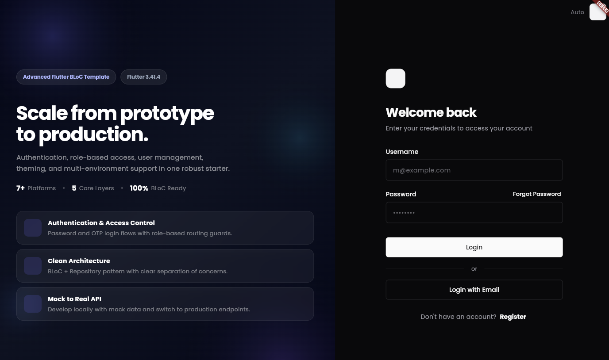
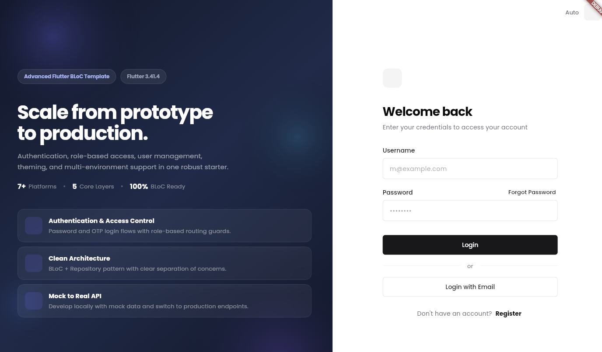
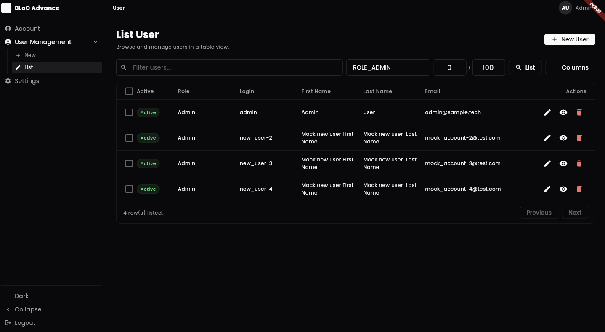
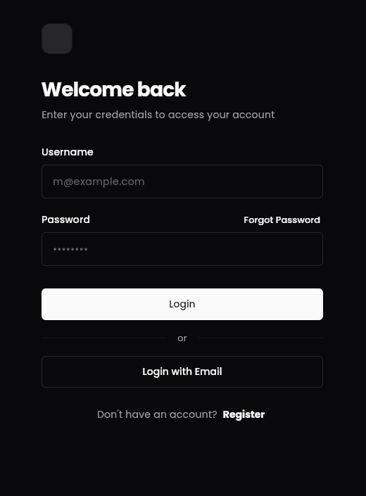
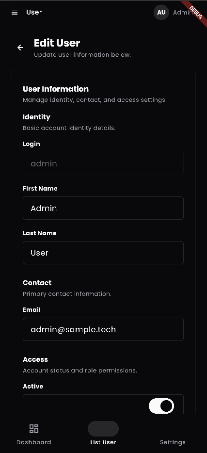
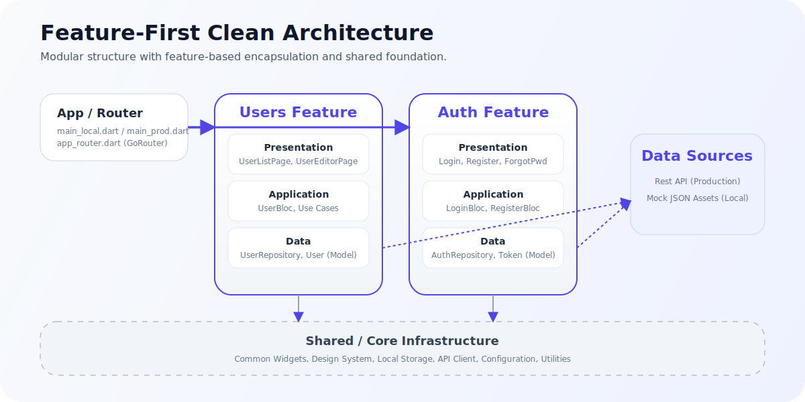

# Advanced Flutter BLoC Template

[](https://opensource.org/licenses/MIT)


A production-ready, community-friendly Flutter starter built with BLoC, repository pattern, responsive UI, role-based access control, internationalization, and multi-environment support. It is designed to help you move from prototype to maintainable product faster across mobile, web, and desktop.

**Useful links:** [Wiki](https://deepwiki.com/cevheri/flutter-bloc-advanced) · [Upgrade Guide](docs/upgrade_flutter_3.41.4.md) · [Report an Issue](https://github.com/cevheri/flutter-bloc-advanced/issues) · [Contributing](#contributing)

## Why This Template?

- Production-oriented structure with clear separation between presentation, business logic, and data access.
- Ready-to-use authentication, role-based routing, user management, localization, theming, and dashboard flows.
- Local mock mode for rapid development and production mode for real API integration.
- Works as an open-source base project for teams, side projects, internal products, and community contributions.

## Screenshots

The screenshots below are included to help contributors and adopters understand the current UX quickly before cloning or running the project.

### Web Experience

| Dark Login | Light Login |
| --- | --- |
|  |  |



### Mobile Experience

| Login | Edit User |
| --- | --- |
|  |  |

## What You Get Out of the Box

### Authentication

- Login with username and password
- Registration flow
- Forgot password flow
- OTP send and verify flow

### User Management

- Create, update, delete, and list users
- Account profile view and update
- Change password screen

### Access Control

- Role-based routing for Admin and User roles
- Public and private route separation
- Protected admin-only pages

### UI and Developer Experience

- Dark and light themes
- Responsive layout support
- English and Turkish localization
- Design system foundation with reusable components
- Multi-platform support for Android, iOS, Web, macOS, Linux, and Windows

### Architecture

- BLoC for state management
- Feature-First Clean Architecture structure
- Use Cases for business logic
- Repository pattern for data access
- Feature-based routing (clean boundaries)
- Manual JSON serialization for models
- Environment-driven configuration for local and production modes



## Quick Start

### Prerequisites

- Flutter `3.41.4` and Dart `3.11.1`
- [FVM](https://fvm.app/documentation/getting-started/installation) recommended for version consistency
- Android SDK for Android builds
- Xcode for iOS and macOS builds

### Install FVM

```shell
# macOS / Linux
brew tap leoafarias/fvm
brew install fvm

# Windows
choco install fvm
```

### Setup

```shell
git clone https://github.com/cevheri/flutter-bloc-advanced.git
cd flutter-bloc-advanced

fvm install 3.41.4
fvm use 3.41.4
fvm flutter pub get
```

### Run Locally With Mock Data

All local requests use `assets/mock/`, so you can explore the app without standing up a backend first.

```shell
# Mobile
fvm flutter run --target lib/main/main_local.dart

# Web
fvm flutter run -d chrome --target lib/main/main_local.dart

# Web with a specific port
fvm flutter run -d chrome --web-port 3000 --target lib/main/main_local.dart
```

### Demo Credentials

| Role | Username | Password | Access |
| --- | --- | --- | --- |
| Admin | `admin` | `admin` | All pages |
| User | `user` | `user` | Own profile and settings |

### Run Against the Real API

```shell
# Mobile
fvm flutter run --target lib/main/main_prod.dart

# Web
fvm flutter run -d chrome --target lib/main/main_prod.dart
```

The production environment is configured in `lib/configuration/environment.dart`.

## Tech Stack

| Category | Technology |
| --- | --- |
| Flutter | 3.41.4 |
| Dart | 3.11.1 |
| State Management | flutter_bloc 9.1.1 |
| Routing | go_router 17.1.0 |
| HTTP | http 1.6.0 |
| Forms | flutter_form_builder 10.3.0+2 |
| Localization | intl 0.20.2, intl_utils 2.8.14 |
| Storage | shared_preferences, get_storage |
| Testing | flutter_test, bloc_test, mockito |

## Project Structure

```text
lib/
  app/                 # Application-wide configuration and routing
  features/            # Feature-based clean architecture modules
    <feature>/
      application/     # BLoCs and Use Cases
      data/            # Models and Repository implementations
      navigation/      # Feature-specific routes
      presentation/    # Feature screens and widgets
  shared/              # Shared logic, models, and UI components
    design_system/     # Design tokens and components
    widgets/           # Shared reusable widgets
  generated/           # Localization generated files
  l10n/                # Localization ARB files
  main/                # Entry points (main_local.dart, main_prod.dart)

test/                  # Mirrors lib/ structure for unit and widget tests
```

## Build, Test, and Quality

### Build

```shell
# Android APK
fvm flutter build apk --target lib/main/main_prod.dart

# iOS
fvm flutter build ios --target lib/main/main_prod.dart

# Web
fvm flutter build web --target lib/main/main_prod.dart
```

### Test

```shell
# Run all tests
fvm flutter test

# Useful for debugging order-dependent issues
fvm flutter test --concurrency=1 --test-randomize-ordering-seed=random
```

### Analyze and Format

```shell
fvm dart analyze
fvm dart fix --apply
fvm dart format . --line-length=120
```

### Test Coverage Focus

| Layer | What is Tested |
| --- | --- |
| Models | `fromJson`, `toJson`, equality, edge cases |
| Repositories | API calls, error handling, mock responses |
| BLoCs | State transitions, event handling, error states |
| Screens | Widget rendering, user interactions, navigation |
| Widgets | Reusable component behavior |

## CI/CD

GitHub Actions workflows included in this repository:

- `build_and_test.yml` for build and test automation
- `build-web.yml` for web builds
- `sonar_scanner.yml` for SonarQube analysis

To enable SonarQube, add the `SONAR_TOKEN` secret to your repository or organization.

## Android Tooling

| Component | Version |
| --- | --- |
| Gradle | 8.14 |
| Android Gradle Plugin | 8.11.1 |
| Kotlin | 2.2.20 |
| Java Compatibility | 17 |
| NDK | Dynamic (`flutter.ndkVersion`) |
| Build Config | Kotlin DSL (`.gradle.kts`) |

## Adding a New Feature

1. Create a new feature folder under `lib/features/`.
2. Define the domain model and repository interface in `lib/features/<feature>/domain/` (optional, can go directly to `data/`).
3. Implement models and repository in `lib/features/<feature>/data/`.
4. Add use cases in `lib/features/<feature>/application/usecases/`.
5. Create BLoC(s) in `lib/features/<feature>/application/`.
6. Implement the UI in `lib/features/<feature>/presentation/pages/`.
7. Define feature routes in `lib/features/<feature>/navigation/`.
8. Register the feature routes in `lib/app/router/app_router.dart`.
9. Add tests in `test/features/<feature>/` mirroring the feature structure.

## Contributing

Community contributions are welcome. If you want to improve the template, add features, polish documentation, or refine the UI, feel free to open an issue or submit a pull request.

1. Fork the repository.
2. Create a feature branch from your fork.
3. Make your changes with tests or documentation updates when relevant.
4. Run `fvm dart analyze` and `fvm flutter test`.
5. Open a pull request with a clear summary of the change.

If you are unsure where to start, documentation improvements, screenshot refreshes, and test coverage enhancements are all valuable contributions.

## References

[](https://deepwiki.com/cevheri/flutter-bloc-advanced)


- [Understanding Flutter BLoC: A Comprehensive Guide](https://cevheri.medium.com/understanding-flutter-bloc-a-comprehensive-guide-7100dabe3975)
- [Flutter Documentation](https://flutter.dev/)
- [BLoC Library](https://bloclibrary.dev/)
- [flutter_bloc on pub.dev](https://pub.dev/packages/flutter_bloc)
- [go_router on pub.dev](https://pub.dev/packages/go_router)
- [Upgrade Guide - Flutter 3.41.4](docs/upgrade_flutter_3.41.4.md)

## License

This project is licensed under the MIT License. See the [LICENSE](LICENSE) file for details.
