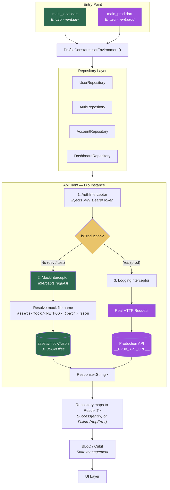
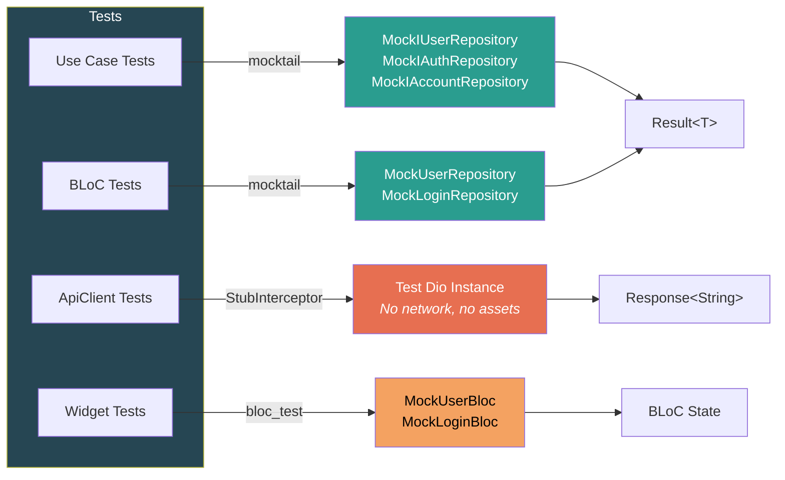

# Mock Data Architecture

This document explains how the project handles real API calls vs. local mock data, how mock JSON files are structured and resolved, and how the test layer works independently of both.

## Overview

The project supports three runtime modes through a single interceptor-based design:

| Mode | Entry Point | Mock Data | Network | Latency |
| --- | --- | --- | --- | --- |
| **Development** | `main_local.dart` | Yes (interceptor) | None | 500 ms simulated |
| **Test** | `Environment.test` | Yes (interceptor) | None | 0 ms |
| **Production** | `main_prod.dart` | No | Real API | Real |

Switching between modes requires **zero code changes** in repositories or BLoCs — only the entry point differs.

## Architecture Diagram



### Test Layer (Independent)



## Interceptor Chain

The Dio HTTP client is created in `lib/infrastructure/http/api_client.dart`:

```dart
dio.interceptors.addAll([
  AuthInterceptor(),                              // always
  if (!ProfileConstants.isProduction) MockInterceptor(),  // dev + test only
  LoggingInterceptor(),                           // always
]);
```

### AuthInterceptor

Reads the JWT token from `AppLocalStorage` and injects it into every outgoing request:

```dart
final jwtToken = await AppLocalStorage().read(StorageKeys.jwtToken.name);
if (jwtToken != null) {
  options.headers['Authorization'] = 'Bearer $jwtToken';
}
```

This runs **before** MockInterceptor so that mock auth checks see the token.

### MockInterceptor

This is the core of the mock system. It intercepts every request in dev/test mode and returns a response loaded from a local JSON file — the request never leaves the device.

**Step-by-step flow:**

1. **Simulated latency** — 500 ms delay in dev mode, skipped in test mode
2. **Auth check** — For non-public paths, rejects with 401 if no `Authorization` header
3. **Status code** — POST → 201, DELETE → 204 (early return), everything else → 200
4. **File resolution** — Builds a file name from the request metadata (see next section)
5. **Asset loading** — Reads the JSON file via `rootBundle.loadString()`
6. **Fallback** — If the file does not exist, returns `"OK"` with the appropriate status code

### LoggingInterceptor

Logs request method, path, status code, and timing via `AppLogger`. Always runs, in every mode.

## Mock File Naming Convention

Mock JSON files live in `assets/mock/` and follow a strict naming pattern:

```
{HTTP_METHOD}{path_with_underscores}[_pathParams|_queryParams].json
```

**Path transformation rules:**
- `/` → `_`
- `-` → `_`

**Examples:**

| Request | Mock File |
| --- | --- |
| `GET /account` | `GET_account.json` |
| `POST /authenticate` | `POST_authenticate.json` |
| `GET /admin/users` | `GET_admin_users.json` |
| `GET /admin/users/{id}` | `GET_admin_users_pathParams.json` |
| `GET /admin/users?page=0&size=10` | `GET_admin_users_queryParams.json` |
| `GET /admin/users/filter?name=John` | `GET_admin_users_filter_queryParams.json` |
| `PUT /admin/users` | `PUT_admin_users.json` |
| `POST /account/change-password` | `POST_account_change_password.json` |
| `DELETE /admin/users/{id}` | *(no file needed — returns 204 directly)* |

**How the file name is resolved** (from `MockInterceptor`):

```dart
final basePath = options.extra['_basePath'] ?? options.path;
final hasPathParams = options.extra['_pathParams'] != null;
final hasQueryParams = options.extra['_queryParams'] != null;
final filePath = basePath.replaceAll('/', '_').replaceAll('-', '_');

if (hasPathParams) {
  mockFileName = '${options.method}${filePath}_pathParams.json';
} else if (hasQueryParams) {
  mockFileName = '${options.method}${filePath}_queryParams.json';
} else {
  mockFileName = '${options.method}$filePath.json';
}
```

The `_basePath`, `_pathParams`, and `_queryParams` metadata are injected by `ApiClient` into `options.extra` so the interceptor can distinguish between `/admin/users` (list) and `/admin/users/123` (single item).

## Mock JSON File Structure

Each file contains the exact JSON the real API would return.

**Single object** (`GET_account.json`):
```json
{
  "id": "user-1",
  "login": "admin",
  "email": "admin@sample.tech",
  "firstName": "Admin",
  "lastName": "User",
  "activated": true,
  "langKey": "en",
  "authorities": ["ROLE_ADMIN", "ROLE_USER"]
}
```

**Array** (`GET_admin_users.json`):
```json
[
  { "id": "user-1", "login": "admin", "firstName": "Admin", ... },
  { "id": "user-2", "login": "user", "firstName": "User", ... }
]
```

**Auth token** (`POST_authenticate.json`):
```json
{
  "id_token": "MOCK_TOKEN"
}
```

**Dashboard data** (`dashboard.json`):
```json
{
  "summary": [
    { "id": "leads", "label": "Leads", "value": 120, "trend": 8 },
    { "id": "customers", "label": "Customers", "value": 54, "trend": -2 }
  ],
  "activities": [ ... ],
  "quick_actions": [ ... ]
}
```

## Public vs. Private Paths

Defined in `lib/core/security/allowed_paths.dart`:

**Public paths** (no JWT required):
- `/authenticate`, `/register`, `/logout`
- `/account/reset-password/init`, `/forgot-password`
- `/authenticate/send-otp`, `/authenticate/verify-otp`

All other paths require a valid `Authorization` header. In dev/test mode the `MockInterceptor` enforces this check; in production the real API does.

## How Repositories Use ApiClient

Repositories are **completely unaware** of whether they are running against mock data or a real API. They always call `ApiClient`:

```dart
class UserRepository implements IUserRepository {
  static const _resource = 'users';

  @override
  Future<Result<UserEntity>> retrieve(String id) async {
    try {
      final response = await ApiClient.get('/admin/$_resource', pathParams: id);
      final result = User.fromJsonString(response.data!);
      return Success(result!);
    } on UnauthorizedException catch (e) {
      return Failure(AuthError(e.toString()));
    } on FetchDataException catch (e) {
      return Failure(NetworkError(e.toString()));
    }
  }
}
```

The `pathParams: id` argument causes `ApiClient` to:
1. Build the URL as `/admin/users/{id}`
2. Store `_basePath: '/admin/users'` and `_pathParams: id` in `options.extra`
3. In dev mode, `MockInterceptor` reads `_pathParams`, resolves `GET_admin_users_pathParams.json`

## Dashboard: Explicit Mock Repository

Dashboard is the one exception where mock behavior is handled at the DI level instead of the interceptor:

```dart
// lib/app/di/app_dependencies.dart
IDashboardRepository createDashboardRepository() =>
    environment == Environment.prod
        ? DashboardApiRepository()   // uses ApiClient → real API
        : DashboardMockRepository(); // reads assets/mock/dashboard.json directly
```

`DashboardMockRepository` loads the JSON via `rootBundle.loadString()` without going through the HTTP layer. This is because the dashboard data structure is complex and does not follow the standard REST endpoint pattern.

## Test Layer

Tests do **not** use the mock interceptor. They mock at the repository interface level using `mocktail`:

```
┌──────────────────────────────────────────────────────────────────┐
│                        Test Layer                                 │
│                                                                   │
│  Use Case Tests:   MockIUserRepository (interface mock)          │
│  BLoC Tests:       MockUserRepository (concrete mock)            │
│  ApiClient Tests:  _StubInterceptor (Dio-level stub)             │
│  Widget Tests:     MockBloc (bloc_test)                          │
└──────────────────────────────────────────────────────────────────┘
```

### Use Case Tests

Mock the repository interface directly. No HTTP involved:

```dart
class MockIUserRepository extends Mock implements IUserRepository {}

test('fetches user by id', () async {
  when(() => mockRepo.retrieve('1'))
      .thenAnswer((_) async => const Success(user));

  final result = await useCase.call('1');
  expect(result, isA<Success<UserEntity>>());
});
```

### BLoC Tests

Mock the repository (or use case) and verify state transitions:

```dart
blocTest<UserBloc, UserState>(
  'emits [loading, success] when fetch succeeds',
  build: () {
    when(() => mockRepo.retrieve('1'))
        .thenAnswer((_) async => const Success(user));
    return UserBloc(repository: mockRepo);
  },
  act: (bloc) => bloc.add(const UserFetchEvent(id: '1')),
  expect: () => [
    const UserState(status: UserStatus.loading),
    const UserState(status: UserStatus.success, user: user),
  ],
);
```

### ApiClient Tests

Use a custom `_StubInterceptor` injected via `ApiClient.setTestInstance()`:

```dart
setUp(() {
  ProfileConstants.setEnvironment(Environment.prod);
  final testDio = Dio(BaseOptions(baseUrl: 'https://test.api'));
  testDio.interceptors.add(stub);
  ApiClient.setTestInstance(testDio);
});

test('maps 401 to UnauthorizedException', () {
  stub.stubDioError(DioExceptionType.badResponse, statusCode: 401);
  expect(() => ApiClient.get('/endpoint'), throwsA(isA<UnauthorizedException>()));
});
```

### Test Bootstrap

`test/test_utils.dart` provides shared setup:

```dart
Future<void> setupUnitTest() async {
  SharedPreferences.setMockInitialValues({});
  ProfileConstants.setEnvironment(Environment.test);
  await AppLocalStorage().save(StorageKeys.jwtToken.name, 'MOCK_TOKEN');
}
```

## Adding a New Mock Endpoint

When you add a new API endpoint, follow these steps:

1. **Create the mock JSON file** in `assets/mock/` following the naming convention:
   ```
   GET_your_endpoint.json              — for GET without params
   GET_your_endpoint_pathParams.json   — for GET with path params
   GET_your_endpoint_queryParams.json  — for GET with query params
   POST_your_endpoint.json             — for POST
   PUT_your_endpoint.json              — for PUT
   ```

2. **Register the asset** in `pubspec.yaml` (already covered by `assets/mock/` glob).

3. **If the endpoint is public**, add the path to `lib/core/security/allowed_paths.dart`.

4. **Call `ApiClient`** from your repository — the mock interceptor handles the rest automatically.

No changes to `MockInterceptor` or `ApiClient` are needed.

## File Reference

| Purpose | Path |
| --- | --- |
| Environment config | `lib/infrastructure/config/environment.dart` |
| API client + Dio factory | `lib/infrastructure/http/api_client.dart` |
| Auth interceptor | `lib/infrastructure/http/interceptors/auth_interceptor.dart` |
| Mock interceptor | `lib/infrastructure/http/interceptors/mock_interceptor.dart` |
| Logging interceptor | `lib/infrastructure/http/interceptors/logging_interceptor.dart` |
| Public path definitions | `lib/core/security/allowed_paths.dart` |
| Template config (API URL) | `lib/infrastructure/config/template_config.dart` |
| Mock JSON files | `assets/mock/*.json` (31 files) |
| DI (repo selection) | `lib/app/di/app_dependencies.dart` |
| Test utilities | `test/test_utils.dart` |
| Mock classes | `test/mocks/mock_classes.dart` |
| ApiClient tests | `test/infrastructure/http/api_client_test.dart` |
